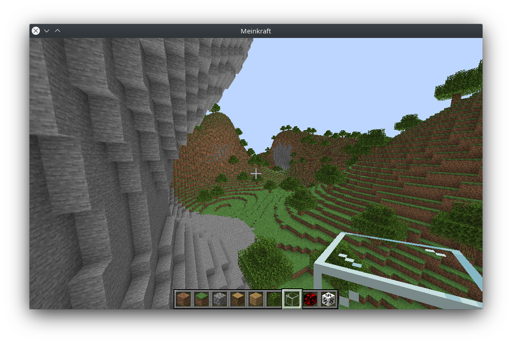

# Meinkraft

A hobby project with the purpose of broadening my knowledge of Rust and OpenGL.\
I chose to make a Minecraft clone because:
1) It's a voxel type game. A voxel game engine is very different from a regular 
game engine.
2) It requires minimal artistic creativity (I'm not a game designer).
3) It's not a graphically intensive game and it introduces enough new concepts 
for me to grasp.
4) Maths and algorithms. From terrain generation to lighting calculations, there 
are interesting algorithms to learn (flood fill, noise functions etc.)
5) I learn a lot about the inner workings of Minecraft and it makes me appreciate 
the game even more.

Don't expect it to be a perfect clone, however I will try imitating as much as 
I can the gameplay and the visuals of Minecraft. I will mostly implement features 
that I find interesting and challenging from a coding perspective. The end goal 
(if it ever happens) is to implement all big features of Minecraft 1.0.

## Compilation
Make sure your graphics card supports OpenGL 4.6 and you have installed the nightly 
toolchain of Rust.\
Run `cargo run --release` to compile and run the game in release mode. I 
recommend compiling in release mode for optimal performance.

## Game settings
The game doesn't have a menu for changing in-game settings. I exposed many parameters 
in the `src/constants.rs` file if you want to change them. The performance should 
be fine even on integrated Intel graphics but if you have low framerate try 
reducing the render distance.

## Current features
* Placing, breaking and picking blocks. 
* Infinite world generation (no save files).
* Player movement, sprinting, sneaking, flying.
* Hotbar (not a full inventory).
* Ambient occlusion

## Screenshots

